# Mission-Control-AI

## Integrantes
- João Marcelo de Melo e Silva - 572569
- Pablo Renato dos Santos Sobral de Carvalho - 569894
- Pedro Vianna Toledo - 570747

## Descrição
Sistema inteligente de monitoramento de missão espacial capaz de analisar as áreas de temperatura, comunicação, bateria, oxigênio e estabilidade operacional, gerando alertas, classificações de risco, recomendações e relatórios automáticos.

## Objetivos
- Monitorar ciclos da missão
- Calcular risco operacional
- Identificar áreas críticas
- Gerar recomendações automáticas
- Produzir relatório final

## Arquitetura do Sistema

O sistema é dividido em quatro grupos principais de funções:

- Funções de análise: avaliam cada área monitorada.
- Funções de cálculo: calculam médias e pontuações de risco de todas as áreas em cada ciclo.
- Funções auxiliares: classificações e identificação de tendências.
- Funções generativas: produzem relatórios de cada ciclo e o relatório final.

## Estrutura dos Dados
A matriz de dados é:
```python
dados_missao = [
    [28.3, 90, 95, 98.2, 95],
    [30.7, 85, 90, 95.5, 90],
    [31.2, 25, 85, 92.4, 88],
    [33.4, 40, 18, 90.1, 80],
    [35.6, 20, 15, 75.6, 35],
    [32.0, 70, 45, 88.2, 75]
]
```

Onde cada linha representa um ciclo e cada coluna representa uma área, organizadas da seguinte forma: **Temperatura, Comunicação, Bateria, Oxigênio, Estabilidade**

## Ciclos Simulados (6)
- Início da missão
- Estabilização dos sistemas
- Queda parcial de comunicação
- Alerta de energia
- Risco operacional
- Tentativa de recuperação

## Funcionalidades
- Análise de cada área na matriz de dados
- Cálculo da média de cada área na missão
- Cálculo do risco médio da missão
- Cálculo da quantidade de ciclos críticos na missão
- Classificação dos status de cada área  
- Classificação dos ciclos
- Classificação da missão
- Análise de tendência entre ciclos e da missão
- Identificação de áreas de maior risco
- Identificação das áreas mais afetadas
- Identificação dos ciclos mais críticos e suas pontuações de risco
- Recomendações de ações em cada ciclo  
- Relatório de cada ciclo
- Relatório final

## Fluxograma do Sistema

```mermaid
flowchart TD

    A[Início do Programa] --> B[Carregar dados da missão]
    B --> C[Definir limites de risco das áreas]

    C --> D[Percorrer ciclos monitorados]

    D --> E[Analisar Temperatura]
    E --> F[Analisar Comunicação]
    F --> G[Analisar Bateria]
    G --> H[Analisar Oxigênio]
    H --> I[Analisar Estabilidade]

    I --> J[Somar pontos de risco do ciclo]

    J --> K[Classificar ciclo<br/>Estável / Atenção / Crítico]

    K --> L[Identificar áreas mais afetadas]
    L --> M[Gerar recomendações]
    M --> N[Analisar tendência em relação ao ciclo anterior]

    N --> O[Exibir relatório do ciclo]

    O --> P{Existem ciclos restantes?}

    P -- Sim --> D

    P -- Não --> R[Identificar áreas mais afetadas da missão]
    R --> S[Identificar tendência geral da missão]
    S --> T[Calcular pontuações acumuladas de cada área]
    T --> U[Identificar o ciclo mais crítico]
    U --> V[Calcular maior pontuação de risco]
    V --> W[Calcular risco médio da missão]
    W --> X[Calcular quantidade de ciclos críticos da missão]
    X --> Y[Calcular média de cada área na missão]
    Y --> Z[Classificar missão]
    Z --> AA[Gerar conclusão]
    AA --> AB[Exibir relatório final]
    AB --> AC[Fim]

    classDef padrao fill:#161618,color:#ffffff,stroke:#ed1165,stroke-width:3px;
    classDef decisao fill:#161618,color:#ffffff,stroke:#ed1165,stroke-width:3px;

    class A,B,C,D,E,F,G,H,I,J,K,L,M,N,O,R,S,T,U,V,W,X,Y,Z,AA,AB,AC padrao;
    class P decisao;
```



## Critérios de Avaliação de Risco
Cada área recebe uma pontuação de risco:
```label
0 = NORMAL
1 = ATENÇÃO
2 = CRÍTICO
```
Baseada na seguinte tabela:

| Área | Normal (0) | Atenção (1) | Crítico (2) |
|--------|--------|--------|--------|
| Temperatura Interna (°C) | > 18 e < 33 | ≥ 33 e < 35 | ≤ 18 ou ≥ 35 |
| Comunicação (%) | > 65 | > 30 e ≤ 65 | ≤ 30 |
| Bateria (%) | > 50 | > 20 e ≤ 50 | ≤ 20 |
| Oxigênio (%) | > 90 | > 80 e ≤ 90 | ≤ 80 |
| Estabilidade (%) | > 65 | > 40 e ≤ 65 | ≤ 40 |

*Observação:* A temperatura é considerada crítica tanto em condições de superaquecimento quanto de resfriamento excessivo, pois ambos os cenários podem comprometer a operação da missão.

---

A pontuação total de cada ciclo é obtida pela soma das pontuações de todas as áreas monitoradas, podendo variar de 0 a 10 pontos. Baseado nessa pontuação, a missão até aquele ciclo pode ser classificada em:

- MISSÃO ESTÁVEL (0 a 2 pontos)
- MISSÃO EM ATENÇÃO (3 a 5 pontos)
- MISSÃO CRÍTICA (6 a 10 pontos) 

Após o último ciclo ser avaliado, a missão é classificada de acordo com a média das pontuações de risco de todos os ciclos. As possíveis classificações da missão são:
  
- MISSÃO ESTÁVEL (risco médio menor que 3)
- MISSÃO EM ATENÇÃO (risco médio entre 3 e 5)
- MISSÃO EM ESTADO CRÍTICO (risco médio maior ou igual a 6)

## Como executar
1. Instale Python 3.10 ou superior
2. Clone o repositório
3. Navegue até a pasta do projeto
4. Execute no terminal:

```bash
python mission_control.py
```

## Exemplo de saída

# Relatório do Ciclo 5:
```
=========================================== CICLO 5: RISCO OPERACIONAL ===========================================

- Temperatura interna: 35.6 °C | CRÍTICO
- Comunicação com a base: 20 % | CRÍTICO
- Sistemas de energia: 15 % | CRÍTICO
- Suporte de oxigênio: 75.6 % | CRÍTICO
- Estabilidade operacional: 35 % | CRÍTICO

- Análise de tendência entre esse ciclo e o último: Piora

- Pontuação de risco do ciclo: 10
- Classificação do ciclo: MISSÃO CRÍTICA
- Área(s) de maior risco: Temperatura interna, Comunicação com a base, Sistemas de energia, Suporte de oxigênio e Estabilidade operacional

- Recomendações: verificar controle térmico, restabelecer contato com a base, ativar modo de economia de energia, acionar protocolo de suporte à vida e reduzir operações não essenciais
```
# Relatório final da missão:
```
================================================ RELATÓRIO FINAL ================================================

Missão: Mission Orion
Equipe: Equipe Apollo
Quantidade de ciclos analisados: 6

As áreas mais afetadas da missão foram: Comunicação com a base e Sistemas de energia com 5 pontos

- Tendência geral da missão: Piora
- Risco do primeiro ciclo da missão: 0 pontos
- Risco do último ciclo da missão: 2 pontos

-- Pontuação acumulada por área --

- Temperatura interna: 3 pontos de risco na missão
- Comunicação com a base: 5 pontos de risco na missão
- Sistemas de energia: 5 pontos de risco na missão
- Suporte de oxigênio: 3 pontos de risco na missão
- Estabilidade operacional: 2 pontos de risco na missão

- Ciclo mais crítico: Ciclo 5
- Maior pontuação de risco: 10
- Risco médio da missão: 3.0
- Quantidade de ciclos críticos: 1

-- Média de dados de cada área --

- Média de temperatura: 31.87 ºC
- Média de comunicação: 55.00%
- Média de bateria: 58.00%
- Média de oxigênio: 90.00%
- Média de estabilidade: 77.17%

Classificação final da missão: MISSÃO EM ATENÇÃO

CONCLUSÃO: 
A missão Mission Orion apresentou instabilidades ao longo dos ciclos monitorados, com seu momento mais crítico ocorrendo no Ciclo 5, 
que atingiu 10 pontos de risco. As áreas mais afetadas foram Comunicação com a Base e Sistemas de Energia, ambas com 5 pontos acumulados. 
Apesar da tendência geral de piora da missão, observou-se uma recuperação parcial no último ciclo, reduzindo o risco para 2 pontos. Com risco 
médio de 3,0 pontos e classificação final de MISSÃO EM ATENÇÃO, recomenda-se manter o monitoramento dos sistemas de comunicação e energia para 
prevenir novas ocorrências críticas.
==================================================================================================================
```
## Tecnologias utilizadas
- Python 3

## Requisitos
- Python 3.10 ou superior
